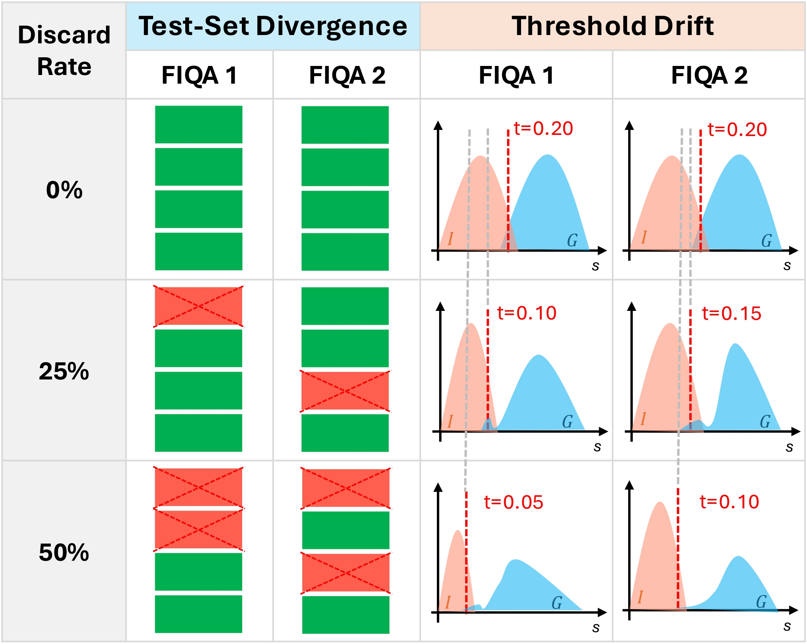
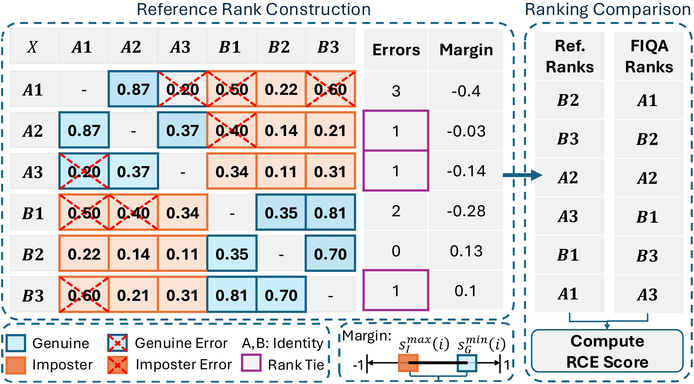
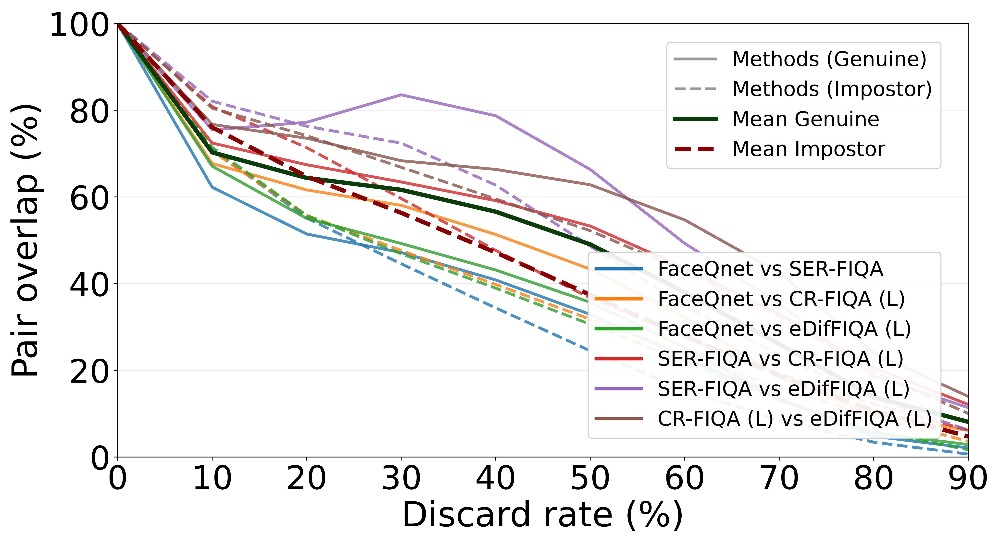
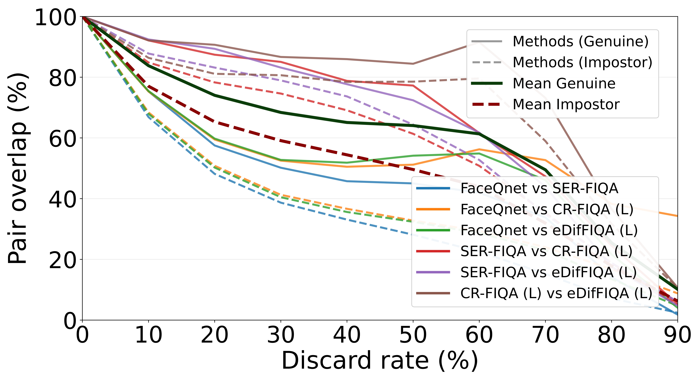
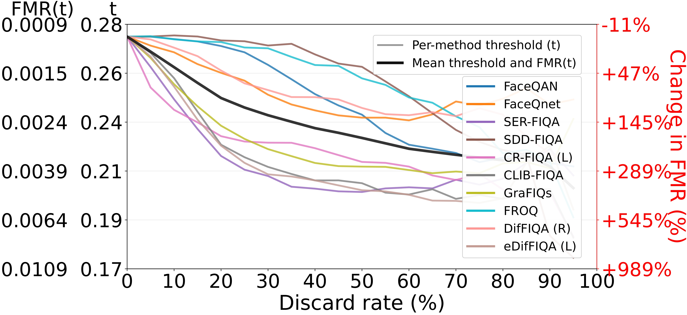
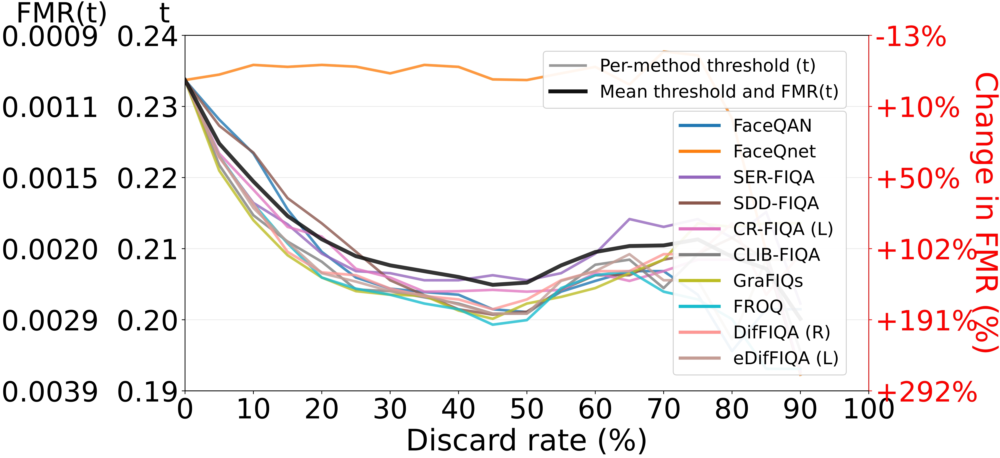

## Beyond Error-vs-Discard Characteristic: Toward Stable and Reliable Evaluation for Face Image Quality Assessment

_Accepted at the IEEE/IAPR International Joint Conference on Biometrics (IJCB 2026)._

* [Research Paper](#) *(Link coming soon)*

## Table of Contents

- [Abstract](#abstract)
- [Installation and RCE Score Computation](#installation-and-rce-score-computation)
- [Results](#results)
- [Citation](#citation)
- [Acknowledgement](#acknowledgement)
- [License](#license)

## Abstract

The standard evaluation protocol for Face Image Quality Assessment, the Error-versus-Discard Characteristic (EDC), has fundamental limitations. EDC progressively discards low-quality samples and measures recognition error on the retained subset. This causes different FIQA methods to be evaluated on different test sets (Test-Set Divergence) and at changing recognition operating points (Threshold Drift), limiting the reliability and comparability of the evaluation. To address this, we propose discard-based EDC variants and a rank-based Rank Consistency Evaluation (RCE) metric that operates on the entire test set without discarding samples, using a fixed decision threshold. This repository provides ready-to-use code for computing RCE scores.


<p align="center">

</p>

Figure: **Limitations of the EDC Protocol.** With increasing discard rates the FIQA methods (a) are evaluated on progressively different test sets (Test-Set Divergence) and (b) operate on completely different opertation points (Threshold Drift), leading to limited comparability of different FIQA methods.

<p align="center">

</p>

Figure: **Visualization of the RCE framework.** In Rank Consistency Evaluation (RCE), the reference ranking is constructed from recognition errors in the test set, with ties resolved based on the maximum imposter-minimum genuine margin. The final RCE score is computed as the weighted rank correlation between the reference ranking and the ranking based on the FIQA predictions.


## Results


<table>
    <tr>
        <td align="center"></td>
        <td align="center"></td>
    </tr>
    <tr>
        <td align="center">Adience</td>
        <td align="center">XQLFW</td>
    </tr>
</table>


**Retained Pair-Set Overlap under EDC.** The plots quantify the pairwise overlap between the test sets of sample pairs retained by different FIQA methods at increasing discard rates. The rapid decline in overlap demonstrates that, under EDC, each method operates on increasingly disjoint subsets of the test data.


<table>
    <tr>
        <td align="center"></td>
        <td align="center"></td>
    </tr>
    <tr>
        <td align="center">Adience</td>
        <td align="center">XQLFW</td>
    </tr>
</table>


**Threshold Drift under EDC.** The plots show how the decision threshold evolves with increasing discard rate across datasets and face recognition models. To quantify its impact, the threshold shifts are translated into corresponding changes in FMR on the full dataset. The results show that EDC drives different methods to operate at substantially different decision points, undermining direct comparability.

## Installation and RCE Score Computation

This section explains how to install the required dependencies and run the code that computes the Rank Consistency Evaluation (RCE) scores.


### Install dependencies:

```bash
pip install numpy pandas scipy
```

### Run the RCE Evaluation

Run the following command to compute the Rank Consistency Evaluation (RCE) scores:


```bash
python rce.py \
        --fr-features-root /home/bw/FIQA/fr_features \
        --quality-dir /home/bw/FIQA/quality_scores \
        --ca-fiqa-data-root /home/bw/FIQA/ca-fiqa/data \
        --out-root output/sol4_rank_sample \
        --threshold-method roc \
        --weight-alphas 0,3
```
Replace `/home/bw/FIQA` with the path to your local repository.

The main command-line arguments are:
- `--fr-features-root`: Root directory containing the face recognition embeddings.
- `--quality-dir`: Root directory containing the quality scores produced by the FIQA methods.
- `--ca-fiqa-data-root`: Root directory containing the verification-pair definitions for each dataset.
- `--out-root`: Directory where the computed RCE results are written.
- `--threshold-method`: Method used to determine the fixed face recognition decision threshold.
- `--weight-alphas`: Comma-separated weighting parameters used for the weighted rank-correlation computation.


#### Required Input Data

The RCE pipeline expects three inputs: face recognition embeddings, FIQA quality scores, and verification pairs.

##### Face Recognition Embeddings

These embeddings are produced by a face recognition model and are stored once per image. They are used to measure recognition similarity for each verification pair.

```text
fr_features/
└── {dataset_name}/
    └── {fr_model}-embeddings.pkl
```

Example:

```text
fr_features/
└── lfw/
    ├── adaface-embeddings.pkl
    └── arcface_o-embeddings.pkl
```

###### Embedding PKL Format

Each key is an image filename and each value is the corresponding embedding vector.

```text
{
    "image_001.jpg": np.array([0.1, 0.2, 0.3]),
    "image_002.jpg": np.array([0.4, 0.5, 0.6])
}
```

---

##### FIQA Quality Scores

These scores are the outputs of the FIQA method.

```text
quality_scores/
└── {fiqa_method}/
    └── {dataset_name}-quality.pkl
```

Example:

```text
quality_scores/
└── cr-fiqa/
    └── lfw-quality.pkl
```

###### Quality Score PKL Format

Each key is an image filename and each value is the predicted quality score for that image.

```text
{
    "image_001.jpg": 0.92,
    "image_002.jpg": 0.71
}
```

---

##### Verification Pairs

This file lists the image pairs that should be evaluated. The labels tell the code whether a pair is genuine or impostor, which is needed to compute the recognition error statistics used by RCE.

```text
data/
└── {dataset_name}/
    └── pairs/
        └── pairs.csv
```

Example:

```text
data/
└── lfw/
    └── pairs/
        └── pairs.csv
```

###### Pairs CSV Format

Each row contains two image identifiers and their pair label.

```text
img1_id,img2_id,label
image_001.jpg,image_002.jpg,1
image_001.jpg,image_003.jpg,0
```

Labels:

- `1`: genuine pair
- `0`: impostor pair


## Citation

If you use this code in your work, please cite the following paper:

```bibtex
@inproceedings{wani2026rce, 
author = {Bhavesh Wani and {\v{Z}}iga Babnik and Vitomir {\v{S}}truc and Philipp Terh{\"o}rst}, 
title = {Beyond Error-vs-Discard Characteristic: Toward Stable and Reliable Evaluation for Face Image Quality Assessment}, 
booktitle = {{IEEE} International Joint Conference on Biometrics, {IJCB} 2026, Rome, Italy, September 1--4, 2026}, 
year = {2026} 
}
```


## Acknowledgement

This work was funded by the Deutsche Forschungsgemeinschaft (DFG, German Research Foundation) under Grant 544631027.

## License

This project is licensed under the terms of the Attribution-NonCommercial 4.0 International (CC BY-NC 4.0) license. Copyright (c) 2026 Johannes Gutenberg University Mainz (JGU). You are free to use, modify, and redistribute this software for non-commercial research purposes, provided appropriate attribution is given. Commercial use requires prior permission from the copyright holder.
